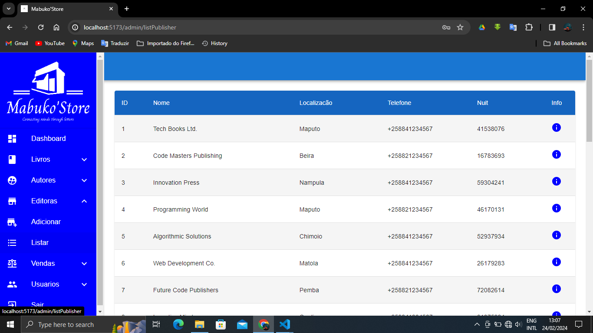

# Sistema de Gestão de Biblioteca

Este é um sistema de gestão de biblioteca desenvolvido em React.js utilizando Material UI.

## Visão Geral

O Sistema de Gestão de Biblioteca permite aos usuários gerenciar os livros em uma biblioteca, incluindo adicionar, editar, excluir e visualizar informações detalhadas sobre cada livro.

## Funcionalidades

- Adicionar novos livros à biblioteca.
- Editar detalhes dos livros existentes.
- Excluir livros da biblioteca.
- Visualizar informações detalhadas sobre cada livro.

## Tecnologias Utilizadas

- React.js
- Material UI

## Instalação

1. Clone o repositório:

   ```bash
   git clone https://github.com/Machaieie/MabukoStore-Web.git
   ```

2. Navegue até o diretório do projeto:

   ```bash
   cd MabukoStore-Web
   ```

3. Instale as dependências:

   ```bash
   npm install
   ```

4. Inicie o aplicativo:

   ```bash
   npm start
   ```

## Contribuição

Contribuições são bem-vindas! Se você quiser contribuir com melhorias, correções de bugs ou novas funcionalidades:

1. Abra uma issue para discutir a alteração que você gostaria de fazer.
2. Faça um fork do repositório.
3. Crie uma branch com as suas alterações: `git checkout -b nome-da-sua-branch`.
4. Faça commit das suas alterações: `git commit -m 'Adiciona nova funcionalidade'`.
5. Faça push para a sua branch: `git push origin nome-da-sua-branch`.
6. Abra um pull request.

## Tela de Login


## Tela de Inicial


## Tela de Dashboard


## Tela de Adicionar Livro


## Tela de Listagem de Livros


## Tela de Adicionar Autor


## Tela de Listagem de Autores


## Tela de Adicionar Editora


## Tela de Listagem de Editoras



## Tela de Vendas


##  Diferentes Metodos de Pagamento

## Pagamento com Banco


## Pagamento por M-Pesa


## Pagamento por E-Mola


## Pagamento por Cartão


## Pagamento por Conta Movel


